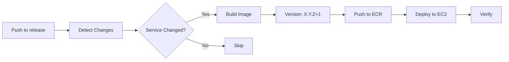

# 🚀 Quick Start Guide - Deployment to EC2 with ECR

Hướng dẫn nhanh để setup CI/CD pipeline deploy BookingCare microservices lên EC2 sử dụng ECR.

## 📋 Prerequisites

- AWS Account với quyền tạo ECR repositories
- EC2 instance đã được provisioned
- SSH access tới EC2 instance
- GitHub repository với code

## 🔧 Setup Steps

### 1️⃣ Setup AWS ECR Repositories

Chạy script để tạo tất cả ECR repositories cần thiết:

```bash
cd scripts
./create-ecr-repos.sh us-east-1
```

Script này sẽ:
- Tạo 19 ECR repositories cho các services
- Enable image scanning on push
- Set lifecycle policy để giữ lại 10 images gần nhất
- Configure encryption

### 2️⃣ Setup EC2 Instance

SSH vào EC2 instance và chạy setup script:

```bash
# Copy script lên EC2
scp -i your-key.pem scripts/setup-ec2.sh ec2-user@your-ec2-ip:~

# SSH vào EC2
ssh -i your-key.pem ec2-user@your-ec2-ip

# Run setup script
bash setup-ec2.sh
```

Script này sẽ cài đặt:
- Docker
- AWS CLI
- Tạo Docker network: `bookingcare-network`
- Configure permissions

**Sau khi chạy script, logout và login lại để docker group có hiệu lực!**

### 3️⃣ Configure GitHub Secrets

Vào GitHub repository → Settings → Secrets and variables → Actions → New repository secret

Thêm các secrets sau:

#### AWS Credentials
```
AWS_ACCESS_KEY_ID
  Value: Your AWS Access Key ID

AWS_SECRET_ACCESS_KEY
  Value: Your AWS Secret Access Key
```

#### EC2 Credentials
```
EC2_HOST
  Value: Your EC2 public IP or hostname
  Example: 54.123.45.67

EC2_USER
  Value: SSH username
  Example: ec2-user (Amazon Linux) or ubuntu (Ubuntu)

EC2_SSH_KEY
  Value: Your private SSH key content
  Example: Copy content from your .pem file
```

### 4️⃣ Configure Environment Variables on EC2

```bash
# SSH vào EC2
ssh -i your-key.pem ec2-user@your-ec2-ip

# Tạo .env file
cp .env.ec2.example .env
nano .env

# Update các values:
# - ECR_REGISTRY: Your ECR registry URL
# - DB_CONNECTION_STRING: Your database connection
# - RABBITMQ_* : Your RabbitMQ config
# - Etc.
```

### 5️⃣ Test ECR Login on EC2

```bash
# Test ECR login
aws ecr get-login-password --region us-east-1 | \
  docker login --username AWS --password-stdin <your-ecr-registry>

# Should see: Login Succeeded
```

### 6️⃣ Deploy!

Push code vào nhánh `release`:

```bash
git checkout release
git merge develop
git push origin release
```

GitHub Actions sẽ tự động:
1. ✅ Detect services có thay đổi
2. 🏗️ Build Docker images với auto-versioning
3. 📤 Push lên ECR
4. 🚀 Deploy lên EC2
5. ✔️ Verify deployment

## 📊 Monitor Deployment

### GitHub Actions UI

Vào repository → Actions tab để xem:
- Real-time logs
- Deployment summary
- Services deployed/skipped

### EC2 Instance

SSH vào EC2 để check:

```bash
# View running containers
docker ps

# View specific service logs
docker logs bookingcare-user

# View all BookingCare containers
docker ps --filter "name=bookingcare-*"

# Test deployment script
~/test-deployment.sh
```

## 🔄 Workflow Overview



## 📝 Example Deployment Flow

**Scenario**: Bạn sửa code trong `BookingCare.Services.User` và `BookingCare.Services.Auth`

### Step 1: Changes Detected
```
✅ user: src/Services/BookingCare.Services.User/** changed
✅ auth: src/Services/BookingCare.Services.Auth/** changed
⏭️ appointment: no changes
⏭️ doctor: no changes
... (other services: no changes)
```

### Step 2: Build & Version
```
user: 1.0.4 → 1.0.5 ✅
auth: 1.2.3 → 1.2.4 ✅
```

### Step 3: Push to ECR
```
bookingcare-user:1.0.5 ✅
bookingcare-user:latest ✅
bookingcare-auth:1.2.4 ✅
bookingcare-auth:latest ✅
```

### Step 4: Deploy to EC2
```
SSH to EC2
  Pull bookingcare-user:1.0.5 ✅
  Stop old container ✅
  Run new container ✅
  
  Pull bookingcare-auth:1.2.4 ✅
  Stop old container ✅
  Run new container ✅
```

### Step 5: Verify
```
bookingcare-user: Running ✅
bookingcare-auth: Running ✅
```

## 🎯 Version Management

### Initial Deploy
```
Service: user
Tag: user-v1.0.0
Image: bookingcare-user:1.0.0
```

### Subsequent Deploys
```
Deploy #2: user-v1.0.1
Deploy #3: user-v1.0.2
Deploy #4: user-v1.0.3
...
```

### View All Versions
```bash
# GitHub
git tag -l "user-v*"

# ECR
aws ecr list-images --repository-name bookingcare-user
```

## 🛠️ Troubleshooting

### Build Failed
```bash
# Check GitHub Actions logs
# → Go to Actions tab → Click on failed workflow
# → Review build logs for errors
```

### ECR Push Failed
```bash
# Verify AWS credentials
aws sts get-caller-identity

# Verify ECR repository exists
aws ecr describe-repositories --repository-names bookingcare-user
```

### Deploy Failed
```bash
# SSH vào EC2
ssh -i key.pem ec2-user@ec2-ip

# Check Docker daemon
sudo systemctl status docker

# Test ECR login
aws ecr get-login-password --region us-east-1 | \
  docker login --username AWS --password-stdin <ecr-registry>

# Check network
docker network ls | grep bookingcare

# View container logs
docker logs bookingcare-user
```

### Container Not Running
```bash
# Check why container stopped
docker logs bookingcare-user

# Check container inspect
docker inspect bookingcare-user

# Try running manually
docker run --rm -it \
  --network bookingcare-network \
  <ecr-registry>/bookingcare-user:latest \
  bash
```

## 🔐 Security Best Practices

1. **Use IAM Roles**: Attach IAM role to EC2 instead of storing AWS credentials
2. **Rotate SSH Keys**: Regularly rotate EC2 SSH keys
3. **Enable Image Scanning**: ECR auto-scans images on push (already configured)
4. **Use Secrets Manager**: Store sensitive configs in AWS Secrets Manager
5. **Network Security**: Configure EC2 security groups properly
6. **HTTPS Only**: Use HTTPS for all external endpoints

## 📚 Additional Resources

- [GitHub Actions Workflow Documentation](.github/workflows/README.md)
- [Docker Compose Example](docker-compose.ec2.yml)
- [Environment Variables](.env.ec2.example)
- [Setup Scripts](scripts/)

## ❓ FAQ

**Q: Tại sao phải logout/login sau khi setup EC2?**
A: Docker group changes cần session mới để có hiệu lực.

**Q: Service không có thay đổi có được deploy không?**
A: Không, workflow chỉ deploy services có thay đổi code để tối ưu thời gian.

**Q: Làm sao để force deploy tất cả services?**
A: Sửa code trong `src/Shared/**` - tất cả services sẽ được deploy.

**Q: Làm sao để rollback về version cũ?**
A: SSH vào EC2, stop container, pull version cũ từ ECR, run lại.

**Q: Version tăng như thế nào?**
A: Auto-increment PATCH version (1.0.0 → 1.0.1 → 1.0.2...)

**Q: Có thể manual trigger deployment không?**
A: Có, vào Actions → Deployment Pipeline → Run workflow.

## 🎉 Success Checklist

- [x] ECR repositories created
- [x] EC2 instance setup complete
- [x] GitHub Secrets configured
- [x] Environment variables on EC2 configured
- [x] ECR login successful on EC2
- [x] Docker network created
- [x] First deployment successful
- [x] All services running
- [x] Health checks passing

Congratulations! 🚀 Your CI/CD pipeline is ready!
