# BookingCare System - Architecture Diagram

## System Architecture Overview

This diagram illustrates the complete architecture of the BookingCare System, showing the interactions between frontend, backend microservices, databases, CI/CD pipeline, and observability stack.

---

## 🎯 Detailed Microservices Architecture Diagram

This enhanced diagram provides a comprehensive view of the entire system architecture with clear separation of concerns and detailed component interactions.

```mermaid
graph TB
    %% ============================================
    %% FRONTEND & USER LAYER
    %% ============================================
    subgraph UserLayer["👥 USER LAYER"]
        User["👤 End Users<br/>(Web Browsers)"]
    end
    
    %% ============================================
    %% AWS CLOUD INFRASTRUCTURE (FRONTEND)
    %% ============================================
    subgraph AWS["☁️ AWS CLOUD INFRASTRUCTURE - FRONTEND HOSTING"]
        direction TB
        
        subgraph CDN["🌐 Content Delivery Network"]
            CloudFront["AWS CloudFront<br/>- Global CDN<br/>- Edge Caching<br/>- SSL/TLS Termination<br/>- DDoS Protection"]
        end
        
        subgraph StaticStorage["💾 Static File Storage"]
            S3["AWS S3 Bucket<br/>- React Build Files<br/>- HTML/CSS/JS/Assets<br/>- Versioned Deployments<br/>- High Availability"]
        end
        
        CloudFront -->|Origin Fetch| S3
    end
    
    %% ============================================
    %% CI/CD PIPELINE
    %% ============================================
    subgraph CICD["🔄 CI/CD PIPELINE - GITHUB ACTIONS"]
        direction TB
        
        GitRepo["📦 GitHub Repository<br/>- Source Code<br/>- Version Control<br/>- Pull Requests"]
        
        subgraph Pipeline["⚙️ Automated Pipeline"]
            Build["🔨 Build Stage<br/>- Compile Code<br/>- Run Tests<br/>- Security Scan"]
            Package["📦 Package Stage<br/>- Docker Build<br/>- Image Push<br/>- Frontend Build"]
            Deploy["🚀 Deploy Stage<br/>- K8s Deploy<br/>- S3 Upload<br/>- Health Check"]
        end
        
        Registry["🐳 Container Registry<br/>Docker Hub / AWS ECR<br/>- Docker Images<br/>- Version Tags"]
        
        GitRepo --> Build
        Build --> Package
        Package --> Registry
        Package --> Deploy
    end
    
    %% ============================================
    %% KUBERNETES CLUSTER (BACKEND)
    %% ============================================
    subgraph K8sCluster["☸️ KUBERNETES CLUSTER - BACKEND INFRASTRUCTURE"]
        direction TB
        
        %% Ingress Layer
        subgraph IngressLayer["🚪 INGRESS & API GATEWAY LAYER"]
            direction LR
            Ingress["Ingress Controller<br/>(NGINX/Traefik)<br/>- Load Balancer<br/>- SSL Termination<br/>- Traffic Routing"]
            APIGateway["API Gateway<br/>(Ocelot)<br/>- Request Routing<br/>- Authentication<br/>- Rate Limiting<br/>- API Composition"]
            
            Ingress --> APIGateway
        end
        
        %% Microservices Layer
        subgraph MicroservicesLayer["⚙️ MICROSERVICES LAYER (ASP.NET Core)"]
            direction TB
            
            subgraph AuthServices["🔐 Authentication & Authorization"]
                AuthService["Auth Service<br/>- JWT Tokens<br/>- User Login<br/>- OAuth2/OIDC"]
            end
            
            subgraph CoreBusinessServices["🏥 Core Business Services"]
                UserService["User Service<br/>- Profile Management<br/>- User CRUD"]
                DoctorService["Doctor Service<br/>- Doctor Profiles<br/>- Specializations"]
                HospitalService["Hospital Service<br/>- Hospital Info<br/>- Facilities"]
                ScheduleService["Schedule Service<br/>- Time Slots<br/>- Availability"]
            end
            
            subgraph BookingServices["📅 Booking & Appointment Services"]
                AppointmentService["Appointment Service<br/>- Booking Logic<br/>- Reservations"]
                SagaService["Saga Orchestrator<br/>- Distributed Txn<br/>- Compensation"]
            end
            
            subgraph SupportServices["💼 Support Services"]
                PaymentService["Payment Service<br/>- Transactions<br/>- Refunds"]
                NotificationService["Notification Service<br/>- Email/SMS<br/>- Push Alerts"]
                ReviewService["Review Service<br/>- Ratings<br/>- Comments"]
            end
            
            subgraph AdditionalServices["📊 Additional Services"]
                AnalyticsService["Analytics Service<br/>- Metrics<br/>- Reports"]
                ContentService["Content Service<br/>- CMS<br/>- Media"]
            end
        end
        
        %% Infrastructure Services in K8s
        subgraph K8sInfra["🔧 INFRASTRUCTURE SERVICES (In-Cluster)"]
            direction LR
            
            subgraph CacheLayer["⚡ Caching Layer"]
                Redis["Redis Cluster<br/>- Distributed Cache<br/>- Session Store<br/>- Rate Limit Data<br/>- Hot Data"]
            end
            
            subgraph MessageLayer["📨 Message Broker"]
                RabbitMQ["RabbitMQ<br/>- Event Bus<br/>- Pub/Sub<br/>- Message Queues<br/>- Async Comm"]
            end
        end
    end
    
    %% ============================================
    %% DATABASE LAYER (EXTERNAL TO K8s)
    %% ============================================
    subgraph DatabaseLayer["🗄️ DATABASE LAYER - SQL SERVER (Per-Service Pattern)"]
        direction TB
        
        subgraph AuthDB_Group["🔐 Auth Database"]
            AuthDB[("Auth DB<br/>SQL Server<br/>- Users<br/>- Tokens<br/>- Roles")]
        end
        
        subgraph CoreDBs["🏥 Core Service Databases"]
            UserDB[("User DB<br/>SQL Server<br/>- Profiles<br/>- Settings")]
            DoctorDB[("Doctor DB<br/>SQL Server<br/>- Doctors<br/>- Specialties")]
            HospitalDB[("Hospital DB<br/>SQL Server<br/>- Hospitals<br/>- Facilities")]
            ScheduleDB[("Schedule DB<br/>SQL Server<br/>- Time Slots<br/>- Availability")]
        end
        
        subgraph BookingDBs["📅 Booking Databases"]
            AppointmentDB[("Appointment DB<br/>SQL Server<br/>- Bookings<br/>- History")]
        end
        
        subgraph SupportDBs["💼 Support Databases"]
            PaymentDB[("Payment DB<br/>SQL Server<br/>- Transactions<br/>- Billing")]
            NotificationDB[("Notification DB<br/>SQL Server<br/>- Messages<br/>- Templates")]
            ReviewDB[("Review DB<br/>SQL Server<br/>- Ratings<br/>- Feedback")]
        end
        
        subgraph AdditionalDBs["📊 Additional Databases"]
            AnalyticsDB[("Analytics DB<br/>SQL Server<br/>- Metrics<br/>- Logs")]
            ContentDB[("Content DB<br/>SQL Server<br/>- Media<br/>- Articles")]
        end
    end
    
    %% ============================================
    %% OBSERVABILITY STACK
    %% ============================================
    subgraph ObservabilityStack["📊 OBSERVABILITY & MONITORING STACK"]
        direction TB
        
        subgraph MetricsLayer["📈 Metrics & Monitoring"]
            Prometheus["Prometheus<br/>- Metrics Scraping<br/>- Time Series DB<br/>- Alert Rules<br/>- Service Discovery"]
            Grafana["Grafana<br/>- Dashboards<br/>- Visualization<br/>- Real-time Graphs<br/>- Alerting UI"]
            
            Prometheus --> Grafana
        end
        
        subgraph TracingLayer["🔍 Distributed Tracing"]
            Jaeger["Jaeger<br/>- Trace Collection<br/>- Span Analysis<br/>- Latency Tracking<br/>- Dependency Graph"]
        end
        
        subgraph LoggingLayer["📝 Centralized Logging"]
            ELK["Elastic Stack<br/>Elasticsearch + Kibana<br/>- Log Aggregation<br/>- Full-text Search<br/>- Log Visualization"]
        end
    end
    
    %% ============================================
    %% EXTERNAL SERVICES
    %% ============================================
    subgraph ExternalServices["🌐 EXTERNAL THIRD-PARTY SERVICES"]
        direction TB
        PaymentGateway["💳 Payment Gateways<br/>Stripe/PayPal/VNPay"]
        EmailProvider["📧 Email Service<br/>SendGrid/SMTP"]
        SMSProvider["📱 SMS Gateway<br/>Twilio"]
    end
    
    %% ============================================
    %% CONNECTIONS - USER TO FRONTEND
    %% ============================================
    User -->|"1. HTTPS Request<br/>(www.example.com)"| CloudFront
    CloudFront -->|"2. Cached/Fetched<br/>Static Files"| User
    
    %% ============================================
    %% CONNECTIONS - FRONTEND TO BACKEND
    %% ============================================
    User -.->|"3. API Requests<br/>(api.example.com)<br/>REST/GraphQL"| Ingress
    
    %% ============================================
    %% CONNECTIONS - CI/CD DEPLOYMENTS
    %% ============================================
    Deploy -->|"Deploy Frontend<br/>Build"| S3
    Deploy -->|"Deploy Backend<br/>Services"| K8sCluster
    Registry -.->|"Pull Docker<br/>Images"| K8sCluster
    
    %% ============================================
    %% CONNECTIONS - INGRESS TO SERVICES
    %% ============================================
    APIGateway -->|Route| AuthService
    APIGateway -->|Route| UserService
    APIGateway -->|Route| DoctorService
    APIGateway -->|Route| HospitalService
    APIGateway -->|Route| ScheduleService
    APIGateway -->|Route| AppointmentService
    APIGateway -->|Route| PaymentService
    APIGateway -->|Route| NotificationService
    APIGateway -->|Route| ReviewService
    APIGateway -->|Route| AnalyticsService
    APIGateway -->|Route| ContentService
    
    %% ============================================
    %% CONNECTIONS - SERVICES TO DATABASES (Per-Service DB)
    %% ============================================
    AuthService -.->|"SQL Queries<br/>Read/Write"| AuthDB
    UserService -.->|"SQL Queries<br/>Read/Write"| UserDB
    DoctorService -.->|"SQL Queries<br/>Read/Write"| DoctorDB
    HospitalService -.->|"SQL Queries<br/>Read/Write"| HospitalDB
    ScheduleService -.->|"SQL Queries<br/>Read/Write"| ScheduleDB
    AppointmentService -.->|"SQL Queries<br/>Read/Write"| AppointmentDB
    PaymentService -.->|"SQL Queries<br/>Read/Write"| PaymentDB
    NotificationService -.->|"SQL Queries<br/>Read/Write"| NotificationDB
    ReviewService -.->|"SQL Queries<br/>Read/Write"| ReviewDB
    AnalyticsService -.->|"SQL Queries<br/>Read/Write"| AnalyticsDB
    ContentService -.->|"SQL Queries<br/>Read/Write"| ContentDB
    
    %% ============================================
    %% CONNECTIONS - SERVICES TO REDIS (CACHING)
    %% ============================================
    AuthService -.->|"Cache<br/>Get/Set"| Redis
    UserService -.->|"Cache<br/>Get/Set"| Redis
    DoctorService -.->|"Cache<br/>Get/Set"| Redis
    HospitalService -.->|"Cache<br/>Get/Set"| Redis
    ScheduleService -.->|"Cache<br/>Get/Set"| Redis
    AppointmentService -.->|"Cache<br/>Get/Set"| Redis
    
    %% ============================================
    %% CONNECTIONS - SERVICES TO MESSAGE BROKER
    %% ============================================
    AuthService -.->|"Pub/Sub<br/>Events"| RabbitMQ
    AppointmentService -.->|"Pub/Sub<br/>Events"| RabbitMQ
    ScheduleService -.->|"Pub/Sub<br/>Events"| RabbitMQ
    PaymentService -.->|"Pub/Sub<br/>Events"| RabbitMQ
    NotificationService -.->|"Pub/Sub<br/>Events"| RabbitMQ
    SagaService -.->|"Orchestrate<br/>Events"| RabbitMQ
    
    %% ============================================
    %% CONNECTIONS - SERVICE-TO-SERVICE (gRPC/REST)
    %% ============================================
    AppointmentService <-.->|"gRPC/REST<br/>Sync Calls"| ScheduleService
    AppointmentService <-.->|"gRPC/REST"| DoctorService
    PaymentService <-.->|"REST"| AppointmentService
    AuthService <-.->|"gRPC"| UserService
    
    %% ============================================
    %% CONNECTIONS - EXTERNAL SERVICES
    %% ============================================
    PaymentService -->|"Payment API<br/>Webhooks"| PaymentGateway
    NotificationService -->|"Send Email"| EmailProvider
    NotificationService -->|"Send SMS"| SMSProvider
    
    %% ============================================
    %% CONNECTIONS - OBSERVABILITY
    %% ============================================
    AuthService -.->|"Metrics<br/>/metrics"| Prometheus
    UserService -.->|"Metrics"| Prometheus
    DoctorService -.->|"Metrics"| Prometheus
    HospitalService -.->|"Metrics"| Prometheus
    ScheduleService -.->|"Metrics"| Prometheus
    AppointmentService -.->|"Metrics"| Prometheus
    PaymentService -.->|"Metrics"| Prometheus
    NotificationService -.->|"Metrics"| Prometheus
    ReviewService -.->|"Metrics"| Prometheus
    AnalyticsService -.->|"Metrics"| Prometheus
    ContentService -.->|"Metrics"| Prometheus
    
    Redis -.->|"Metrics"| Prometheus
    RabbitMQ -.->|"Metrics"| Prometheus
    Ingress -.->|"Metrics"| Prometheus
    
    AuthService -.->|"Traces<br/>OpenTelemetry"| Jaeger
    UserService -.->|"Traces"| Jaeger
    AppointmentService -.->|"Traces"| Jaeger
    PaymentService -.->|"Traces"| Jaeger
    ScheduleService -.->|"Traces"| Jaeger
    
    AuthService -.->|"Logs"| ELK
    UserService -.->|"Logs"| ELK
    AppointmentService -.->|"Logs"| ELK
    PaymentService -.->|"Logs"| ELK
    Ingress -.->|"Logs"| ELK
    
    %% ============================================
    %% STYLING
    %% ============================================
    classDef userStyle fill:#E8F5E9,stroke:#4CAF50,stroke-width:3px,color:#000,font-weight:bold
    classDef awsStyle fill:#FF9900,stroke:#232F3E,stroke-width:3px,color:#fff,font-weight:bold
    classDef cicdStyle fill:#2088FF,stroke:#0366d6,stroke-width:3px,color:#fff,font-weight:bold
    classDef k8sStyle fill:#326CE5,stroke:#fff,stroke-width:3px,color:#fff,font-weight:bold
    classDef ingressStyle fill:#009639,stroke:#fff,stroke-width:2px,color:#fff,font-weight:bold
    classDef serviceStyle fill:#512BD4,stroke:#fff,stroke-width:2px,color:#fff
    classDef dbStyle fill:#CC2927,stroke:#fff,stroke-width:2px,color:#fff,font-weight:bold
    classDef cacheStyle fill:#DC382D,stroke:#fff,stroke-width:2px,color:#fff,font-weight:bold
    classDef brokerStyle fill:#FF6600,stroke:#fff,stroke-width:2px,color:#fff,font-weight:bold
    classDef observabilityStyle fill:#F46800,stroke:#333,stroke-width:2px,color:#fff,font-weight:bold
    classDef externalStyle fill:#00C7B7,stroke:#333,stroke-width:2px,color:#000,font-weight:bold
    
    class User userStyle
    class S3,CloudFront awsStyle
    class GitRepo,Build,Package,Deploy,Registry cicdStyle
    class Ingress,APIGateway ingressStyle
    class AuthService,UserService,DoctorService,HospitalService,ScheduleService,AppointmentService,SagaService,PaymentService,NotificationService,ReviewService,AnalyticsService,ContentService serviceStyle
    class AuthDB,UserDB,DoctorDB,HospitalDB,ScheduleDB,AppointmentDB,PaymentDB,NotificationDB,ReviewDB,AnalyticsDB,ContentDB dbStyle
    class Redis cacheStyle
    class RabbitMQ brokerStyle
    class Prometheus,Grafana,Jaeger,ELK observabilityStyle
    class PaymentGateway,EmailProvider,SMSProvider externalStyle
```



---

## 📋 Original System Architecture Diagram

The following diagram shows the complete BookingCare System architecture with all services:

```mermaid
graph TB
    %% External User
    User[👤 User/Client Browser]
    
    %% CI/CD Pipeline
    subgraph CICD["🔄 CI/CD Pipeline"]
        GitHub["GitHub Repository<br/>(Source Code)"]
        GitHubActions["GitHub Actions<br/>(Build, Test, Deploy)"]
        DockerRegistry["Container Registry<br/>(Docker Images)"]
    end
    
    %% AWS Cloud Services
    subgraph AWS["☁️ AWS Cloud Services"]
        S3["AWS S3<br/>(Static Files Storage)"]
        CloudFront["AWS CloudFront<br/>(CDN & Cache)"]
    end
    
    %% Frontend Deployment
    subgraph FrontendDeploy["🖥️ Frontend Deployment"]
        ReactBuild["React + TypeScript<br/>(Production Build)"]
    end
    
    %% Kubernetes Cluster
    subgraph K8s["☸️ Kubernetes Cluster"]
        direction TB
        
        %% Ingress Layer
        subgraph IngressLayer["🚪 Ingress Layer"]
            Ingress["Ingress Controller<br/>(NGINX/Traefik)"]
            Ocelot["Ocelot API Gateway<br/>(Routing & Auth)"]
        end
        
        %% Microservices Pods
        subgraph MicroservicesPods["⚙️ Microservices (ASP.NET Core Pods)"]
            direction TB
            
            subgraph CoreServices["Core Services"]
                AuthPod["🔐 Auth Service Pod"]
                UserPod["👥 User Service Pod"]
                DoctorPod["👨‍⚕️ Doctor Service Pod"]
                HospitalPod["🏥 Hospital Service Pod"]
            end
            
            subgraph BookingServices["Booking Services"]
                AppointmentPod["📅 Appointment Service Pod"]
                SchedulePod["🗓️ Schedule Service Pod"]
                SagaPod["🔄 Saga Service Pod"]
            end
            
            subgraph SupportServices["Support Services"]
                PaymentPod["💳 Payment Service Pod"]
                NotificationPod["🔔 Notification Service Pod"]
                ReviewPod["⭐ Review Service Pod"]
            end
            
            subgraph AdditionalServices["Additional Services"]
                AIPod["🤖 AI Service Pod"]
                AnalyticsPod["📊 Analytics Service Pod"]
                ContentPod["📝 Content Service Pod"]
                OtherPods["... Other Services"]
            end
        end
        
        %% Cache Layer in K8s
        subgraph CacheLayer["⚡ Cache Layer"]
            RedisCluster["Redis Cluster<br/>(Distributed Cache)"]
        end
        
        %% Message Broker in K8s
        subgraph MessageBroker["📨 Message Broker"]
            RabbitMQ["RabbitMQ Cluster<br/>(Event Bus)"]
        end
    end
    
    
    %% Database Layer (External to K8s)
    subgraph Databases["🗄️ Database Layer - SQL Server"]
        direction TB
        AuthDB[(Auth DB)]
        UserDB[(User DB)]
        DoctorDB[(Doctor DB)]
        HospitalDB[(Hospital DB)]
        AppointmentDB[(Appointment DB)]
        ScheduleDB[(Schedule DB)]
        PaymentDB[(Payment DB)]
        NotificationDB[(Notification DB)]
        ReviewDB[(Review DB)]
        AIDB[(AI DB)]
        AnalyticsDB[(Analytics DB)]
        ContentDB[(Content DB)]
        OtherDBs[(Other DBs)]
    end
    
    %% Observability Stack
    subgraph Observability["📊 Observability & Monitoring"]
        direction TB
        Prometheus["Prometheus<br/>(Metrics Collection)"]
        Grafana["Grafana<br/>(Dashboards & Visualization)"]
        Jaeger["Jaeger<br/>(Distributed Tracing)"]
        ElasticStack["Elastic Stack<br/>(Centralized Logging)<br/>Elasticsearch + Kibana"]
    end
    
    %% External Services
    subgraph ExternalServices["🌐 External Services"]
        PaymentGateway["💰 Payment Gateway<br/>(Stripe/PayPal/VNPay)"]
        EmailService["📧 Email Service<br/>(SMTP/SendGrid)"]
        SMSService["📱 SMS Service"]
        StorageService["☁️ Storage Service<br/>(AWS S3)"]
    end
    
    %% ============ CONNECTIONS ============
    
    %% CI/CD Flow
    GitHub -->|Push Code| GitHubActions
    GitHubActions -->|Build & Test| DockerRegistry
    GitHubActions -->|Deploy Frontend| S3
    GitHubActions -->|Deploy Backend| K8s
    DockerRegistry -.->|Pull Images| K8s
    
    %% Frontend Flow
    ReactBuild -->|Upload Static Files| S3
    S3 -->|Origin| CloudFront
    User -->|HTTPS Request| CloudFront
    CloudFront -->|Cached Response| User
    
    %% User to Backend Flow
    User -->|API Calls<br/>(REST/GraphQL)| Ingress
    Ingress -->|Route| Ocelot
    
    %% API Gateway to Microservices
    Ocelot -->|Route & Auth| AuthPod
    Ocelot -->|Route| UserPod
    Ocelot -->|Route| DoctorPod
    Ocelot -->|Route| HospitalPod
    Ocelot -->|Route| AppointmentPod
    Ocelot -->|Route| SchedulePod
    Ocelot -->|Route| PaymentPod
    Ocelot -->|Route| NotificationPod
    Ocelot -->|Route| ReviewPod
    Ocelot -->|Route| AIPod
    Ocelot -->|Route| AnalyticsPod
    Ocelot -->|Route| ContentPod
    
    %% Service to Database Connections
    AuthPod -.->|SQL Queries| AuthDB
    UserPod -.->|SQL Queries| UserDB
    DoctorPod -.->|SQL Queries| DoctorDB
    HospitalPod -.->|SQL Queries| HospitalDB
    AppointmentPod -.->|SQL Queries| AppointmentDB
    SchedulePod -.->|SQL Queries| ScheduleDB
    PaymentPod -.->|SQL Queries| PaymentDB
    NotificationPod -.->|SQL Queries| NotificationDB
    ReviewPod -.->|SQL Queries| ReviewDB
    AIPod -.->|SQL Queries| AIDB
    AnalyticsPod -.->|SQL Queries| AnalyticsDB
    ContentPod -.->|SQL Queries| ContentDB
    OtherPods -.->|SQL Queries| OtherDBs
    
    %% Cache Layer Connections
    AuthPod -.->|Cache Get/Set| RedisCluster
    UserPod -.->|Cache Get/Set| RedisCluster
    DoctorPod -.->|Cache Get/Set| RedisCluster
    HospitalPod -.->|Cache Get/Set| RedisCluster
    AppointmentPod -.->|Cache Get/Set| RedisCluster
    SchedulePod -.->|Cache Get/Set| RedisCluster
    
    %% Message Broker Connections (Event-Driven)
    AuthPod -.->|Publish/Subscribe| RabbitMQ
    UserPod -.->|Publish/Subscribe| RabbitMQ
    AppointmentPod -.->|Publish/Subscribe| RabbitMQ
    SchedulePod -.->|Publish/Subscribe| RabbitMQ
    PaymentPod -.->|Publish/Subscribe| RabbitMQ
    NotificationPod -.->|Publish/Subscribe| RabbitMQ
    SagaPod -.->|Orchestrate| RabbitMQ
    
    %% Service-to-Service Communication (REST/gRPC)
    AuthPod <-.->|gRPC| UserPod
    AppointmentPod <-.->|gRPC| SchedulePod
    AppointmentPod <-.->|gRPC| DoctorPod
    PaymentPod <-.->|REST| AppointmentPod
    
    %% External Service Connections
    PaymentPod -->|Payment API| PaymentGateway
    NotificationPod -->|Send Email| EmailService
    NotificationPod -->|Send SMS| SMSService
    ContentPod -->|Upload Files| StorageService
    
    %% Observability Connections
    MicroservicesPods -.->|Expose /metrics| Prometheus
    Prometheus -->|Scrape Metrics| Prometheus
    Prometheus -->|Data Source| Grafana
    MicroservicesPods -.->|Send Traces| Jaeger
    MicroservicesPods -.->|Send Logs| ElasticStack
    Ingress -.->|Logs| ElasticStack
    RedisCluster -.->|Metrics| Prometheus
    RabbitMQ -.->|Metrics| Prometheus
    
    %% Styling
    classDef aws fill:#FF9900,stroke:#232F3E,stroke-width:2px,color:#fff
    classDef cicd fill:#2088FF,stroke:#333,stroke-width:2px,color:#fff
    classDef frontend fill:#61dafb,stroke:#333,stroke-width:2px,color:#000
    classDef k8s fill:#326CE5,stroke:#333,stroke-width:2px,color:#fff
    classDef ingress fill:#009639,stroke:#333,stroke-width:2px,color:#fff
    classDef service fill:#512BD4,stroke:#333,stroke-width:2px,color:#fff
    classDef database fill:#CC2927,stroke:#333,stroke-width:2px,color:#fff
    classDef cache fill:#DC382D,stroke:#333,stroke-width:2px,color:#fff
    classDef broker fill:#FF6600,stroke:#333,stroke-width:2px,color:#fff
    classDef observability fill:#F46800,stroke:#333,stroke-width:2px,color:#fff
    classDef external fill:#00C7B7,stroke:#333,stroke-width:2px,color:#000
    
    class S3,CloudFront aws
    class GitHub,GitHubActions,DockerRegistry cicd
    class ReactBuild frontend
    class Ingress,Ocelot ingress
    class AuthPod,UserPod,DoctorPod,HospitalPod,AppointmentPod,SchedulePod,PaymentPod,NotificationPod,ReviewPod,SagaPod,AIPod,AnalyticsPod,ContentPod,OtherPods service
    class AuthDB,UserDB,DoctorDB,HospitalDB,AppointmentDB,ScheduleDB,PaymentDB,NotificationDB,ReviewDB,AIDB,AnalyticsDB,ContentDB,OtherDBs database
    class RedisCluster cache
    class RabbitMQ broker
    class Prometheus,Grafana,Jaeger,ElasticStack observability
    class PaymentGateway,EmailService,SMSService,StorageService external
```

## Detailed Architecture Components

### 1. **CI/CD Pipeline (GitHub Actions)**

**Components:**
- **GitHub Repository**: Source code version control
- **GitHub Actions**: Automated CI/CD workflows
  - **Build Stage**: Compile code, run unit tests
  - **Test Stage**: Integration tests, security scans
  - **Deploy Stage**: Deploy to Kubernetes cluster and AWS S3
- **Container Registry**: Store Docker images for microservices

**Workflow:**
1. Developer pushes code to GitHub
2. GitHub Actions triggers automated pipeline
3. Pipeline builds Docker images and pushes to registry
4. Pipeline builds React frontend and uploads to S3
5. Pipeline deploys updated services to Kubernetes cluster

---

### 2. **Frontend Architecture**

**Components:**
- **React + TypeScript**: Modern SPA framework
- **AWS S3**: Static file storage (HTML, CSS, JS, assets)
- **AWS CloudFront**: CDN for global content delivery and caching

**Flow:**
1. React app is built into static files (production build)
2. Static files are uploaded to S3 bucket
3. CloudFront serves as CDN origin pointing to S3
4. Users access the app through CloudFront (low latency, cached)
5. Frontend makes API calls to backend via Ingress Controller

---

### 3. **Kubernetes Cluster (Backend Infrastructure)**

**Components:**

#### **Ingress Layer**
- **Ingress Controller** (NGINX/Traefik): Routes external traffic to internal services
- **Ocelot API Gateway**: 
  - API routing and aggregation
  - JWT authentication & authorization
  - Rate limiting and throttling
  - Load balancing

#### **Microservices (ASP.NET Core Pods)**
Each service runs as a Kubernetes Pod with:
- **Auto-scaling**: Horizontal Pod Autoscaler (HPA) based on CPU/memory
- **Health checks**: Liveness and readiness probes
- **Rolling updates**: Zero-downtime deployments
- **Resource limits**: CPU and memory constraints

**Service Categories:**
- **Core Services**: Auth, User, Doctor, Hospital
- **Booking Services**: Appointment, Schedule, Saga (orchestration)
- **Support Services**: Payment, Notification, Review
- **Additional Services**: AI, Analytics, Content, etc.

#### **Cache Layer**
- **Redis Cluster**: Distributed caching for:
  - Session management
  - Frequently accessed data
  - Rate limiting counters
  - Temporary data storage

#### **Message Broker**
- **RabbitMQ Cluster**: Event-driven communication
  - Publish/Subscribe pattern
  - Event sourcing
  - Saga orchestration
  - Decouples microservices

---

### 4. **Database Layer (SQL Server)**

**Architecture:**
- **Database-per-Service Pattern**: Each microservice has its own database
- **Benefits**:
  - Data isolation and autonomy
  - Independent scaling
  - Technology flexibility
  - Fault isolation

**Databases:**
- Auth DB, User DB, Doctor DB, Hospital DB
- Appointment DB, Schedule DB, Payment DB
- Notification DB, Review DB, Analytics DB
- Content DB, AI DB, and other service-specific databases

---

### 5. **Observability & Monitoring Stack**

#### **Prometheus** (Metrics Collection)
- Scrapes metrics from microservices via `/metrics` endpoint
- Collects infrastructure metrics (CPU, memory, network)
- Time-series database for metrics storage
- Alert manager for notifications

#### **Grafana** (Visualization)
- Connects to Prometheus as data source
- Real-time dashboards for:
  - Service health and performance
  - Request rates and latency
  - Error rates and status codes
  - Infrastructure resource usage
  - Business metrics

#### **Jaeger** (Distributed Tracing)
- Traces requests across microservices
- Identifies performance bottlenecks
- Visualizes service dependencies
- Debugging distributed transactions

#### **Elastic Stack** (Centralized Logging)
- **Elasticsearch**: Log storage and indexing
- **Logstash/Fluentd**: Log aggregation and processing
- **Kibana**: Log visualization and search
- Collects logs from all services and infrastructure

---

### 6. **Service Communication Patterns**

#### **Synchronous Communication**
- **REST APIs**: Standard HTTP/HTTPS requests
- **gRPC**: High-performance RPC for internal service communication
  - Binary protocol (faster than JSON)
  - Strong typing with Protocol Buffers
  - Bi-directional streaming

#### **Asynchronous Communication**
- **RabbitMQ Event Bus**: Publish/Subscribe pattern
  - Services publish domain events
  - Interested services subscribe to events
  - Eventual consistency model
  - Saga pattern for distributed transactions

---

### 7. **External Services Integration**

**Payment Gateway**
- Stripe, PayPal, VNPay integration
- Payment processing and webhooks
- PCI DSS compliance

**Communication Services**
- **Email Service**: SendGrid/SMTP for transactional emails
- **SMS Service**: Twilio/custom provider for SMS notifications

**Storage Service**
- **AWS S3**: File and image storage
- Presigned URLs for secure uploads/downloads

---

### 8. **Deployment & Scaling**

**Kubernetes Features:**
- **Deployments**: Declarative updates and rollbacks
- **Services**: Load balancing and service discovery
- **ConfigMaps & Secrets**: Configuration management
- **Persistent Volumes**: Stateful data storage
- **Horizontal Pod Autoscaler**: Auto-scaling based on metrics
- **Network Policies**: Security and traffic control

**High Availability:**
- Multi-replica deployments
- Load balancing across pods
- Health checks and self-healing
- Rolling updates with zero downtime

---

### 9. **User Interaction Flow**

**Frontend Flow:**
1. User accesses `https://example.com`
2. DNS resolves to CloudFront distribution
3. CloudFront serves cached static files from S3
4. React app loads in browser

**API Request Flow:**
1. User interacts with React app (e.g., book appointment)
2. Frontend makes API call to `https://api.example.com/appointments`
3. Request hits Kubernetes Ingress Controller
4. Ingress routes to Ocelot API Gateway
5. Ocelot validates JWT token with Auth Service
6. Ocelot routes request to Appointment Service
7. Appointment Service:
   - Checks Redis cache
   - Queries Appointment DB
   - Publishes event to RabbitMQ
   - Sends trace to Jaeger
   - Logs to Elastic Stack
   - Exposes metrics to Prometheus
8. Response returns through Ocelot → Ingress → Frontend
9. User sees updated UI

**Event-Driven Flow (Example: Appointment Created):**
1. Appointment Service publishes `AppointmentCreated` event
2. RabbitMQ distributes event to subscribers:
   - **Notification Service**: Sends email/SMS confirmation
   - **Schedule Service**: Updates doctor's schedule
   - **Analytics Service**: Records booking metrics
3. Each service processes event independently

---

### 10. **Security Considerations**

- **API Gateway**: JWT authentication, rate limiting
- **TLS/SSL**: All external communication encrypted
- **Network Policies**: Restrict pod-to-pod communication
- **Secrets Management**: Kubernetes secrets for sensitive data
- **RBAC**: Role-based access control in Kubernetes
- **Security Scanning**: Container image vulnerability scanning in CI/CD

---

### 11. **Monitoring & Alerting**

**Key Metrics:**
- Request rate, latency, error rate (RED method)
- CPU, memory, disk, network (USE method)
- Business metrics (bookings, revenue, user activity)

**Alerts:**
- High error rates
- Service downtime
- Resource exhaustion
- Slow response times
- Failed deployments

---

## Technology Stack Summary

| Layer | Technology |
|-------|-----------|
| **Frontend** | React, TypeScript, Vite, Redux |
| **Backend** | ASP.NET Core, C# |
| **API Gateway** | Ocelot |
| **Databases** | Microsoft SQL Server |
| **Cache** | Redis |
| **Message Broker** | RabbitMQ |
| **Orchestration** | Kubernetes |
| **CI/CD** | GitHub Actions |
| **CDN** | AWS CloudFront |
| **Storage** | AWS S3 |
| **Monitoring** | Prometheus, Grafana |
| **Tracing** | Jaeger |
| **Logging** | Elastic Stack (ELK) |
| **Container Registry** | Docker Hub / AWS ECR |

---

## Benefits of This Architecture

✅ **Scalability**: Independent scaling of services based on demand  
✅ **Resilience**: Fault isolation, self-healing, redundancy  
✅ **Maintainability**: Clear service boundaries, separation of concerns  
✅ **Observability**: Comprehensive metrics, logs, and traces  
✅ **Performance**: CDN caching, Redis caching, efficient service communication  
✅ **Security**: Multiple layers of security (API Gateway, network policies, encryption)  
✅ **Developer Experience**: Automated CI/CD, fast feedback loops  
✅ **Cost Optimization**: Scale down unused services, efficient resource utilization  

---

**Last Updated**: October 2, 2025
