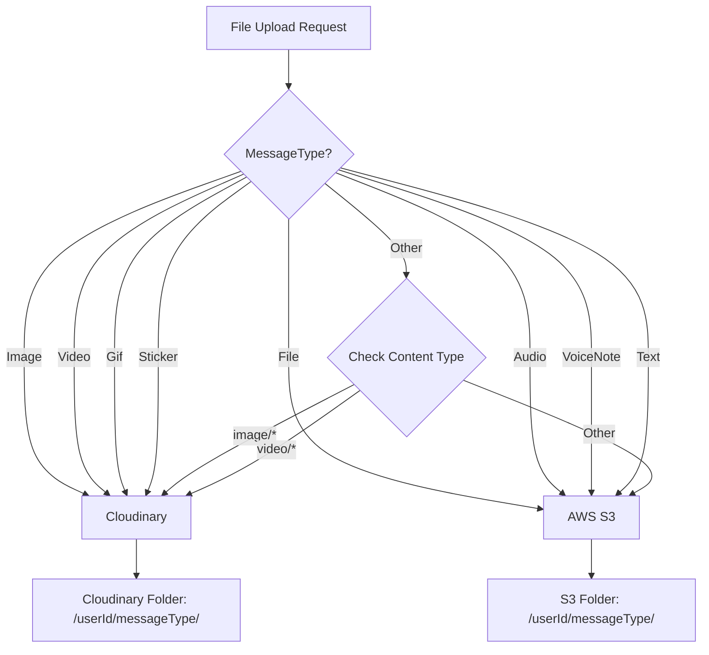

# ?? File Upload Routing Guide - Communication Service

## ?? **V?n ?? ?ã s?a:**

**Tr??c ?ây:** File `.txt` upload v?i `MessageType.Image` ? upload vào th? m?c `/image/`  
**Bây gi?:** Smart routing + validation s? báo l?i và g?i ý s? d?ng `MessageType.File`

## ?? **Smart Routing Logic**

### **Cloudinary Routes (Rich Media Processing)**
- `MessageType.Image` ? Cloudinary (thumbnail generation, optimization)
- `MessageType.Video` ? Cloudinary (video processing, thumbnails)
- `MessageType.Gif` ? Cloudinary (animation processing)
- `MessageType.Sticker` ? Cloudinary (image processing)

### **AWS S3 Routes (Document Storage)**
- `MessageType.File` ? AWS S3 + CloudFront (documents, PDFs, text files)
- `MessageType.Audio` ? AWS S3 + CloudFront (better cost for audio)
- `MessageType.VoiceNote` ? AWS S3 + CloudFront (voice messages)
- `MessageType.Text` ? AWS S3 + CloudFront (plain text files)

## ? **Correct Usage Examples**

### **Text File Upload (.txt, .md, .rtf)**
```http
POST /api/enhanced-fileupload/smart-upload
Content-Type: multipart/form-data

file: document.txt
userId: user-123
messageType: File  ? (NOT Image!)
```

### **Image Upload (.jpg, .png, .gif)**
```http
POST /api/enhanced-fileupload/smart-upload
Content-Type: multipart/form-data

file: photo.jpg
userId: user-123
messageType: Image  ?
```

### **PDF Document Upload**
```http
POST /api/enhanced-fileupload/smart-upload
Content-Type: multipart/form-data

file: report.pdf
userId: user-123
messageType: File  ?
```

## ?? **Validation Errors & Suggestions**

### **Example 1: Wrong MessageType for Text File**
```json
{
  "success": false,
  "message": "Validation failed",
  "errors": [
    "MessageType is 'Image' but file content type is 'text/plain'. Expected image/* content type.",
    "Suggestion: Use MessageType.File for document files like 'document.txt'"
  ]
}
```

### **Example 2: Helpful Info for File Type**
```json
{
  "success": false,
  "message": "Validation failed", 
  "errors": [
    "Info: File 'photo.jpg' appears to be an image. Consider using MessageType.Image for better optimization."
  ]
}
```

## ?? **Folder Structure After Fix**

### **AWS S3 Structure**
```
communication/
??? user-123/
?   ??? file/           ? .txt, .pdf, .doc files
?   ??? audio/          ? .mp3, .wav files  
?   ??? voicenote/      ? voice recordings
?   ??? text/           ? plain text files
```

### **Cloudinary Structure**
```
communication/
??? user-123/
?   ??? image/          ? .jpg, .png files with thumbnails
?   ??? video/          ? .mp4, .webm files with processing
?   ??? gif/            ? .gif animations
?   ??? sticker/        ? sticker images
```

## ?? **How to Fix Existing Wrong Uploads**

### **Option 1: Use Correct MessageType**
```javascript
// ? Wrong
const formData = new FormData();
formData.append('file', textFile);
formData.append('userId', 'user-123');
formData.append('messageType', 'Image'); // Wrong!

// ? Correct
const formData = new FormData();
formData.append('file', textFile);
formData.append('userId', 'user-123');
formData.append('messageType', 'File'); // Correct!
```

### **Option 2: Use Direct S3 Upload for Documents**
```http
POST /api/enhanced-fileupload/s3/upload
Content-Type: multipart/form-data

file: document.txt
userId: user-123
messageType: File
customFolder: documents/important  # Optional custom folder
```

## ?? **Routing Decision Tree**



## ?? **Best Practices**

1. **Always match MessageType with file content**
2. **Use MessageType.File for documents and unknown types**  
3. **Use MessageType.Image only for actual images**
4. **Check validation errors for helpful suggestions**
5. **Use smart-upload endpoint for automatic routing**

## ?? **Debugging Wrong Uploads**

### **Check Upload Logs**
```bash
# Look for routing decisions in logs
grep "Routing to" /var/log/communication-service.log

# Example output:
"Routing to AWS S3 for File with content type text/plain"
"Routing to Cloudinary for Image with content type image/jpeg"
```

### **Verify File Location**
```bash
# S3 files should be in CloudFront URLs
https://your-domain.cloudfront.net/communication/user-123/file/document.txt

# Cloudinary files should be in Cloudinary URLs  
https://res.cloudinary.com/your-cloud/upload/communication/user-123/image/photo.jpg
```