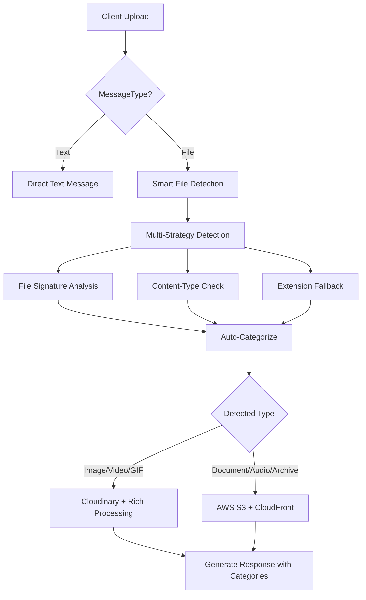

# ?? Smart Message API - Simplified File Upload

## ?? **Concept: Professional & User-Friendly**

Thay vì client ph?i bi?t và ch? ??nh chính xác lo?i file (Image, Video, Audio, Document), gi? ?ây ch? c?n:
- `Text`: Cho tin nh?n text thu?n
- `File`: Cho b?t k? file nào - **server s? t? ??ng detect và route**

## ? **Smart Detection Flow**



## ?? **API Usage Examples**

### **1. Text Message (Unchanged)**
```http
POST /api/communications/messages/smart
Content-Type: application/json

{
  "conversationId": "conv-123",
  "senderId": "user-456", 
  "content": "Hello! How are you?",
  "type": "Text"
}
```

### **2. File Message (Auto-Detection)**
```http
POST /api/communications/messages/smart-files
Content-Type: multipart/form-data

conversationId: conv-123
senderId: user-456
content: "Check out this photo!"
files: photo.jpg        ? Server auto-detects: Image ? Cloudinary
files: document.pdf     ? Server auto-detects: Document ? S3
files: music.mp3        ? Server auto-detects: Audio ? S3
```

### **3. Response v?i Auto-Detection Info**
```json
{
  "success": true,
  "data": {
    "id": "msg-789",
    "conversationId": "conv-123",
    "senderId": "user-456",
    "content": "Check out this photo!",
    "type": "File",
    "attachments": [
      {
        "url": "https://res.cloudinary.com/upload/photo.jpg",
        "name": "photo.jpg",
        "size": 1024000,
        "mimeType": "image/jpeg",
        "detectedType": "Image",           ? Auto-detected!
        "category": "Media",              ? UI Grouping
        "storage": "Cloudinary",          ? Smart routing
        "folder": "communication/user-456/images"
      },
      {
        "url": "https://d24em9p7s2uixh.cloudfront.net/documents/doc.pdf",
        "name": "document.pdf", 
        "size": 2048000,
        "mimeType": "application/pdf",
        "detectedType": "Document",       ? Auto-detected!
        "category": "Documents",          ? UI Grouping
        "storage": "AWS S3",             ? Smart routing
        "folder": "communication/user-456/documents"
      }
    ]
  }
}
```

## ?? **Detection Strategies**

### **Priority 1: File Signature (Most Accurate)**
```
JPEG: FF D8 FF
PNG:  89 50 4E 47
GIF:  47 49 46
PDF:  25 50 44 46 (%PDF)
ZIP:  50 4B 03 04 (PK)
```

### **Priority 2: Content-Type Header**
```
image/* ? Image/GIF (with gif check)
video/* ? Video  
audio/* ? Audio
application/pdf ? Document
text/plain ? Document
application/*zip* ? Archive
```

### **Priority 3: File Extension (Fallback)**
```
.jpg/.png/.webp ? Image
.gif ? GIF
.mp4/.avi ? Video
.mp3/.wav ? Audio
.pdf/.doc/.txt ? Document
.zip/.rar ? Archive
```

## ?? **Auto-Generated Folder Structure**

```
AWS S3 Bucket:
communication/
??? user-123/
?   ??? images/          ? JPG, PNG, WEBP (detected)
?   ??? videos/          ? MP4, AVI, MOV (detected)  
?   ??? audio/           ? MP3, WAV, OGG (detected)
?   ??? documents/       ? PDF, DOC, TXT (detected)
?   ??? archives/        ? ZIP, RAR, 7Z (detected)
?   ??? gifs/           ? GIF files (detected)
?   ??? files/          ? Unknown/Other types

Cloudinary:
communication/
??? user-123/
?   ??? images/          ? Rich image processing
?   ??? videos/          ? Video thumbnails + processing
?   ??? gifs/            ? Animation processing
```

## ?? **Migration Path**

### **Phase 1: Dual Support (Current)**
```javascript
// Old API (still works)
const formData = new FormData();
formData.append('type', 'Image');  // Client specifies

// New API (recommended)  
const formData = new FormData();
formData.append('type', 'File');   // Server detects
```

### **Phase 2: Smart Default (Future)**
```javascript
// Even simpler - type auto-inferred
const formData = new FormData();
// No type needed - server auto-detects from files
```

## ?? **Frontend Integration**

### **React/Vue Component Example**
```javascript
const uploadMessage = async (files, content) => {
  const formData = new FormData();
  formData.append('conversationId', conversationId);
  formData.append('senderId', currentUser.id);
  formData.append('content', content);
  
  // Simple: just append files, server handles the rest
  files.forEach(file => formData.append('files', file));
  
  const response = await fetch('/api/communications/messages/smart-files', {
    method: 'POST',
    body: formData
  });
  
  const result = await response.json();
  
  // Result contains auto-detected types for UI rendering
  result.data.attachments.forEach(attachment => {
    console.log(`${attachment.name} detected as ${attachment.detectedType}`);
    console.log(`Stored in ${attachment.storage} at ${attachment.folder}`);
  });
};
```

### **UI Categories for File Grouping**
```javascript
const renderAttachment = (attachment) => {
  switch(attachment.category) {
    case 'Media':
      return <ImagePreview src={attachment.url} />;
    case 'Documents': 
      return <DocumentViewer url={attachment.url} />;
    case 'Audio':
      return <AudioPlayer src={attachment.url} />;
    default:
      return <FileDownload url={attachment.url} />;
  }
};
```

## ?? **Benefits Summary**

| Aspect | Before (Manual) | After (Smart) | Benefits |
|--------|----------------|---------------|----------|
| **Client Complexity** | Must specify exact type | Just Text/File | Simplified |
| **Error Rate** | High (wrong types) | Low (auto-detect) | Reliable |
| **Folder Organization** | Manual/inconsistent | Auto-organized | Professional |
| **Storage Routing** | Manual logic | Smart routing | Optimized |
| **File Validation** | Client-side guessing | Server-side accurate | Secure |

## ?? **Professional Benefits**

1. **WhatsApp-like Experience**: Users just attach files, app handles the rest
2. **Automatic Organization**: Files auto-sorted into logical folders  
3. **Optimal Storage**: Rich media ? Cloudinary, documents ? S3
4. **Error Reduction**: No more wrong MessageType selections
5. **Future-Proof**: Easy to add new file types without client changes

---

## ? **Result: Professional & User-Friendly**

Clients ch? c?n bi?t:
- **Text**: Cho tin nh?n text
- **File**: Cho b?t k? file nào

Server lo t?t c? vi?c detect, categorize, và route! ??